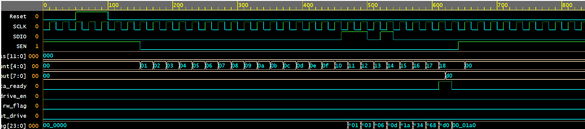

# ADC3664 SPI Slave Controller

This project implements a Verilog-based **SPI Slave** interface designed for the **ADC3664** high-speed ADC. It handles 24-bit control frames, allowing for register configuration and status monitoring.

## 📌 Module Overview
The module follows the standard SPI protocol where data is sampled on the **rising edge** of `SCLK`. It supports a 12-bit addressing scheme and an 8-bit data width.

### SPI Frame Format (24 Bits)
| Bits | Name | Description |
| :--- | :--- | :--- |
| **23** | `R/W` | 0 = Write Operation, 1 = Read Operation |
| **22:11** | `Address` | 12-bit Register Address |
| **10:8** | `Reserved` | Reserved bits (usually 0) |
| **7:0** | `Data` | 8-bit Data Payload |

---

## 🌊 Functional Waveform Analysis
The simulation result below (`SPI_slave.png`) illustrates a successful **Write Transaction**:



### Key Phases observed:
1.  **Reset Phase:** At the start, the `Reset` signal (active high) initializes the `bit_count` and internal registers.
2.  **Enable (`SEN`):** The transaction begins when `SEN` pulls **Low**. This enables the internal counter.
3.  **Address Decoding:** Between `bit_count` 0x01 and 0x10 (16 bits), the module captures the R/W flag and the memory address (`0x001`).
4.  **Data Capture:** From `bit_count` 0x11 to 0x18 (bits 17–24), the `SDIO` data (Value: `0xA0`) is shifted into the memory.
5.  **Completion:** Once the 24th bit is received, `data_ready` pulses high, and `data_out` updates to reflect the value stored in the targeted memory address.

---

## 🛠 Hardware Interface

| Signal | Direction | Description |
| :--- | :--- | :--- |
| `SCLK` | Input | SPI Serial Clock |
| `SEN` | Input | Serial Interface Enable (Active Low) |
| `Reset` | Input | System Reset (Active High) |
| `SDIO` | Inout | Bidirectional Serial Data I/O |
| `data_out` | Output | 8-bit captured data for monitoring |
| `data_ready`| Output | Status flag indicating write completion |

---

## 🚀 Simulation with Verilator
This design is optimized for **Verilator 5.0+**. Use the following commands to run the testbench and generate waveforms(currently we are using EDA Playground as it supports opensource simulators):

```bash
# Compile and Build the simulation
verilator --prefix Vsim --binary --timing --build-jobs 0 \
          --build --trace-vcd -Wno-fatal --timescale 1ns/1ns \
          design.v testbench.v

# Execute the simulation
./obj_dir/Vsim

# View the output
gtkwave waveform.vcd
